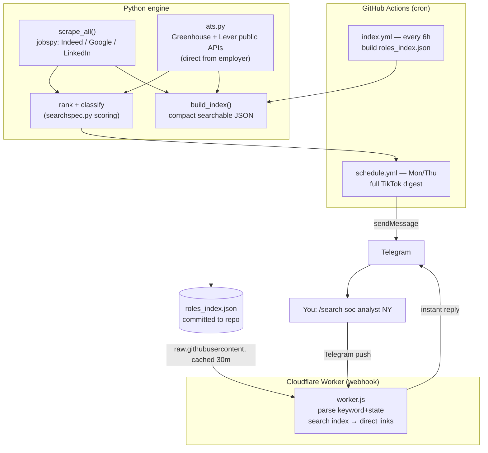
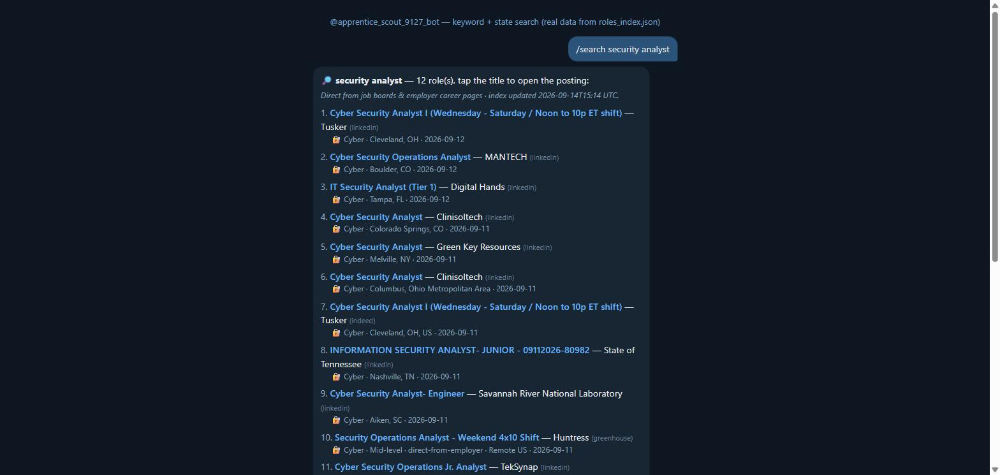
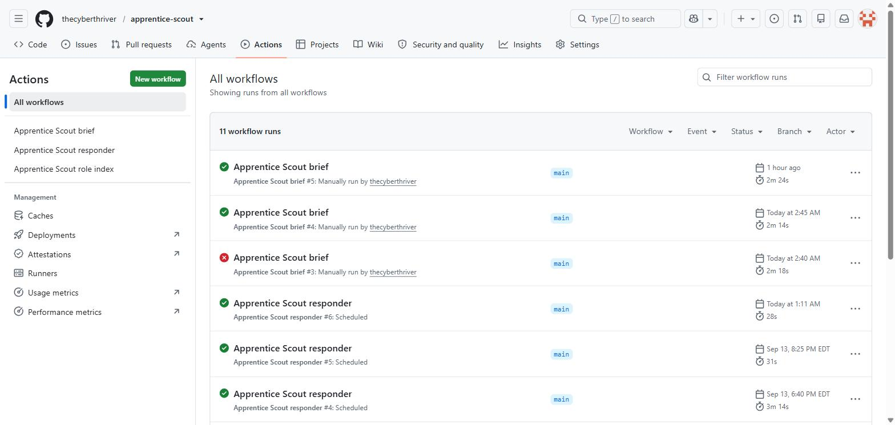

# Apprentice Scout — How It Works (Workshop Guide)

A Telegram bot that finds **paid, entry‑to‑mid cybersecurity & IT roles** — from
job boards **and** straight from employer/ATS career pages — and lets you search
them by **keyword + state**, returning links **directly to the posting**.

This doc is the teaching companion for the workshop: architecture, data flow,
setup, and the design decisions worth explaining to a room.

---

## 1. What it does

| Surface | Trigger | What you get |
|---|---|---|
| **Instant search** | Text the bot `/search soc analyst NY` | Real roles matching keyword + state, each linking **straight to the job posting**. Answered in ~1s by a Cloudflare Worker. |
| **Scheduled brief** | Mon/Thu 8 AM ET (GitHub Actions) | A film‑ready TikTok digest: apprenticeships / rotational / new‑grad, a career‑changer set, and a **“Straight from employer career pages (ATS)”** section. |

Two design rules run through the whole thing:

1. **No third‑party reposters.** Links resolve to the real employer/ATS posting
   (Greenhouse, Lever, Workday, SmartRecruiters, ADP…) or the board’s own job
   page — never a scraped‑and‑relisted middleman.
2. **Instant, not laggy.** Interactive search is answered by a webhook (push),
   not a slow poll.

---

## 2. Architecture



**Why a webhook + index (the key teaching point):** a Cloudflare Worker can’t run
`python-jobspy` and can’t scrape 40+ boards inside one request. So the heavy work
(scraping) runs on a schedule in GitHub Actions and is written to a small
`roles_index.json`; the Worker just **reads and filters that index** — which is
why `/search` is instant and always available.

---

## 3. Data sources (and why they’re allowed)

| Source | How | Third‑party? |
|---|---|---|
| **Indeed / Google Jobs / LinkedIn** | `python-jobspy` | Job boards. We keep Indeed’s `job_url_direct` so links point at the **employer/ATS**, and drop known reposter companies (`EXCLUDE_COMPANIES`). |
| **Greenhouse** | Public board API `boards-api.greenhouse.io/v1/boards/<slug>/jobs` | **No** — the employer’s own ATS, published for job distribution. |
| **Lever** | Public API `api.lever.co/v0/postings/<slug>?mode=json` | **No** — same. |
| **hiring.cafe** | Tap‑through link only (its search API is auth‑gated) | Aggregator, but indexes company/ATS pages. Link, not scrape. |

Ethics to teach: **public data only, respect rate limits & ToS, no login‑walled
scraping, screen out reposters.** Each board fetch is isolated so one failing
never breaks a run.

---

## 4. Keyword + state search

```
/search soc analyst NY      → SOC/analyst roles in New York, direct links
/search help desk texas     → help-desk roles in Texas
/search security engineer   → nationwide
/search NY   (or just NY)   → everything indexed in New York
```

How the Worker parses it:

1. Split the text after `/search`. A **trailing 2‑letter code or state name** is
   the state; the rest is the **keyword**.
2. Read `roles_index.json` (cached ~30 min in the Worker).
3. Keep roles where **every keyword term matches on a word boundary** (so `soc`
   doesn’t match “as**soc**iates”) **and** the state matches.
4. Return up to 12, each linking **directly to the posting**. No matches → offer
   live‑search links as a fallback.

---

## 5. The role index

`build_index()` (run by `index.yml` every 6h) scrapes everything, de‑dupes, and
writes `roles_index.json`:

```json
{
  "generated": "2026-09-14T15:14:32+00:00",
  "count": 387,
  "roles": [
    {
      "t": "SOC Analyst I", "c": "Acme Corp",
      "u": "https://boards.greenhouse.io/acme/jobs/123",
      "loc": "New York, NY, US", "st": "NY",
      "sal": "$70,000–90,000/yr", "posted": "2026-09-12",
      "src": "greenhouse", "tag": "🔐 Cyber · Entry-level",
      "kw": "soc analyst i acme corp ..."
    }
  ]
}
```

`t` title · `c` company · `u` **direct URL** · `st` 2‑letter state · `kw` search
blob. Small (~130 KB / ~400 roles) so the Worker parses it cheaply.

---

## 6. Repository map

| File | Role |
|---|---|
| `apprentice_scout.py` | Engine: scrape → classify → digest → Telegram. Modes: default (digest), `--preview`, `--build-index`, `--state XX`, `--serve-once` (legacy poller), `--chatid`. |
| `searchspec.py` | Content knobs: queries, scoring keywords, `ENTRY_MID_TITLES`, `GREENHOUSE_BOARDS`/`LEVER_BOARDS`, `place_links()`. |
| `ats.py` | Direct employer/ATS scraping (Greenhouse + Lever). |
| `roles_index.json` | Searchable role index the Worker serves. |
| `cloudflare-webhook/worker.js` | The instant `/search` webhook. |
| `cloudflare-webhook/set_webhook.py` | Point Telegram at the Worker. |
| `.github/workflows/schedule.yml` | Twice‑weekly digest. |
| `.github/workflows/index.yml` | 6‑hourly index rebuild. |
| `.github/workflows/responder.yml` | Legacy getUpdates poller (disabled; webhook replaces it). |

---

## 7. Setup (from zero)

**A. Telegram bot** — talk to `@BotFather`, `/newbot`, save the token. Message
your bot once, then `python apprentice_scout.py --chatid` to get your chat id.
Put both in `secrets_local.py` (untracked).

**B. Cloudflare Worker (instant search)** — from `cloudflare-webhook/`:
```
npx wrangler login
npx wrangler deploy
# pipe secrets from secrets_local.py (never printed):
python - <<'PY' | npx wrangler secret put TELEGRAM_BOT_TOKEN
import sys; sys.path.insert(0,".."); import secrets_local as s; print(s.TELEGRAM_BOT_TOKEN)
PY
python - <<'PY' | npx wrangler secret put WEBHOOK_SECRET
import sys; sys.path.insert(0,".."); import secrets_local as s; print(s.WEBHOOK_SECRET)
PY
python - <<'PY' | npx wrangler secret put OWNER_CHAT_ID
import sys; sys.path.insert(0,".."); import secrets_local as s; print(s.TELEGRAM_CHAT_ID)
PY
python set_webhook.py https://apprentice-scout-bot.<subdomain>.workers.dev
```

**C. GitHub Actions** — add repo secrets `TELEGRAM_BOT_TOKEN`, `TELEGRAM_CHAT_ID`
(and `ANTHROPIC_API_KEY` if you want AI captions). `schedule.yml` sends the
digest; `index.yml` refreshes the search index.

**D. Add more employer boards** — drop a verified `("slug", "Name")` into
`GREENHOUSE_BOARDS` in `searchspec.py`. Verify first:
`https://boards-api.greenhouse.io/v1/boards/<slug>/jobs`.

---

## 8. Screenshots

**`/search` — keyword + state → real roles, direct links** (rendered from live
`roles_index.json` data):



**GitHub Actions — the three workflows** (digest, index, legacy responder):



> The `/search` image is a faithful render of the bot's actual reply using real
> index data. For live in‑app chat captures, take phone screenshots of your
> Telegram conversation and drop them in `docs/screenshots/`.
